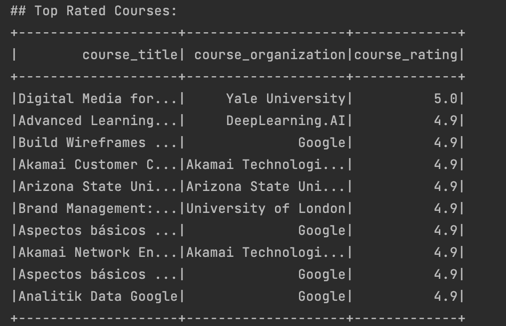

[](https://github.com/nogibjj/IDS706-MiniProject10-PySpark/actions/workflows/cicd.yml)

# Template for IDS706 weekly mini-projects 

## Goal

> Duke University IDS 706 Weekly Mini Project 10

Requirements
- Use PySpark to perform data processing on a large dataset
- Include at least one Spark SQL query and one data transformation


## Preparation

1. Python 3.9.x or above
2. pyspark

## Run and Result

### Basic PySpark
PySpark is used to read the data and clean the data:

The data clean process includes: drop the null value, drop the duplicate value, drop the column that is not needed.

Furthermore, strings are converted to numbers, and the data is converted to a format that can be used for analysis.

In addition, Clean 'course_time' and standardize it to months.

The result is as follows:


Course Difficulty Distribution


### PySpark with SQL

Top rated courses in each category

```sql
    SELECT course_title, course_organization, course_rating
    FROM courses
    WHERE course_rating IS NOT NULL
    ORDER BY course_rating DESC
    LIMIT 10
```




## Reference

1.  https://github.com/nogibjj/python-template
2.  https://github.com/helenyjx/Rust-Powered-Calculator-Microservice-in-the-Cloud

